<!-- HIGH-STABILITY PREMIUM HEADER -->

  <strong>The Executive Battery Health Ecosystem for Android</strong>

 

<!-- WIDE PRESENTATION TABLE -->
<table width="100%" border="0" cellspacing="0" cellpadding="0">
  <tr>
    <td width="45%" align="center">
      <!-- THE ANIMATED SVG -->
      
       
      <code style="color: #00F0FF; font-size: 14px;">[ CORE_ENGINE: STABLE ]</code>
    </td>
    <td width="55%" align="left" style="padding-left: 30px;">
      <h2 align="left">
        
      </h2>
      

        <strong>Architected & Developed by  SANDEEP SOM</strong> 
        <em>Lead Android Performance Engineer</em>
      

      

      

        PlugPact is a premium, high-fidelity utility designed to eliminate battery degradation. By fusing <strong>AGSL Procedural Shaders</strong> with <strong>Low-Level Hardware Telemetry</strong>, it protects your device with sci-fi aesthetics.
      

      

        
        
        
      

    </td>
  </tr>
</table>

 

---

## ⚡ EXECUTIVE SYSTEM FEATURES

> [!TIP]
> **What makes PlugPact different?** Unlike other battery apps, PlugPact requires **Zero Internet Permissions**. Your hardware data never leaves your device.

| Feature | Description | Status |
| :--- | :--- | :--- |
| **Micro-Spark HUD** | A 3D Procedural Electric arc that floats on the AOD/Lock-Screen. | 🟢 ACTIVE |
| **Night Guard** | Smart 80% Healthy Charge Ceiling with premium auditory chimes. | 🟢 ACTIVE |
| **Master Diagnostics** | TAMM-inspired floating "Master Button" for deep-cell telemetry. | 🟢 ACTIVE |
| **OLED Protection** | Autonomous pixel-shifting engine to prevent screen burn-in. | 🟢 ACTIVE |

---

## 🛠️ TECHNICAL ARCHITECTURE
Developed by **Sandeep Som** using an enterprise-grade mobile stack:

*   **UI Engine:** Jetpack Compose (Declarative Design System).
*   **Graphics:** AGSL (Android Graphics Shading Language) for GPU-accelerated sparks.
*   **Background Core:** Lifecycle-aware Foreground Services for 24/7 monitoring.
*   **State Management:** Kotlin Coroutines & StateFlow for real-time mA/mV updates.

---

## 🔒 SECURITY & PRIVACY MANIFESTO
*   **No Internet Permission:** The app is physically incapable of sending data.
*   **Zero Analytics:** No trackers, no ads, no bloatware.
*   **Open Source:** Built by the community, for the community.

---

## 🚀 INSTALLATION & DEPLOYMENT

1.  Navigate to the **Actions** tab at the top of this repository.
2.  Select the latest **PlugPact Build Engine** (the one with the Green Tick).
3.  Scroll down to the **Artifacts** section.
4.  Download the `PlugPact-v1-Debug` ZIP, extract, and install the APK.

 

**© 2026 SANDEEP SOM | ALL RIGHTS RESERVED**
*Precision Engineering • High-End Digital Aesthetics*

